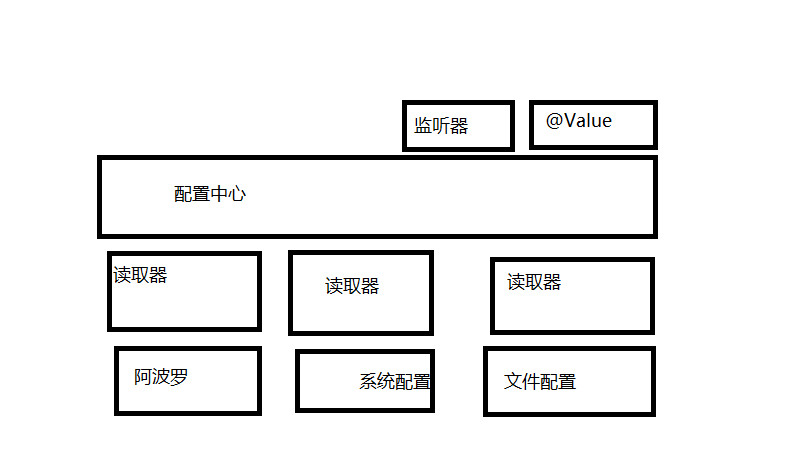

# sumk-apollo
sumk和apollo的整合包:

## sumk
https://github.com/youtongluan/sumk

## apollo
https://github.com/ctripcorp/apollo

## 功能
- 所有配置都可生效
- 配置生效顺序：`system属性 -> app.properties -> apollo`，system属性 、app.properties一般存储固定配置
- 支持AppInfo、@Value、@ApolloJsonValue支持属性或方法级别动态注入
  - 如果使用方法级别注入，可以在方法内编写回调逻辑
  - @Value、@ApolloJsonValue目前注入属性类型仅支持string

## Architecture
### 类图

### 整合设计
#### 与sumk整合后分层结构

1. 通过以上的的结构进行分层，监听器、@Value是Sumk内置通过配置中心获取配置的途径。
2. 中间的配置中心指的是AppInfo。
3. 如果需要引入某个配置中心依赖比如本工程，则需要增加响应的读取器（sumk-apollo），由读取器去读取配置源（apollo）。
4. 替换了某个配置，只需要替换读取器（和可能包含更新器）就行，其它模块都不需要变更。
5. 与spring的不同：spring会存在跨层，例如当@Value值变更，要设置新值时绕过配置中心（Spring CompositePropertySource），直接通过读取器设置到@Value对应的字段或方法上，
   可以说是性能和通用性的取舍，但根本原因是spring内部没有提供配置中心（Spring CompositePropertySource）变更listener的机制，导致只能通过跨层调用来刷新配置，分层结构被破坏。

#### Apollo-Client 注册
1. ApolloWatcher 负责Apollo 配置注册，order为`Integer.MIN_VALUE`，保证启动顺序的情况下，其他组件也可以使用Apollo配置。
2. 初始化ApolloSystemConfig动态变更配置，与ComposedConfig组合，实现配置优先级读取（`system属性 -> app.properties -> apollo`）。

#### AppInfo读取流程
1. ApolloSystemConfig为AppInfo读取核心配置类，其中init方法在`SystemConfigHolder.setSystemConfig`通过onStart间接启动。
2. 由于Apollo配置变更和修改以namespace为最小粒度，且namespace对应Apollo-Client的模型是Config，
   所以根据用户注册的namespace集合，在`ApolloSystemConfig.init`阶段动态生成多个ApolloPropertyConfig，
   ApolloPropertyConfig:Config:namespace = 1:1:1，由于ApolloPropertyConfig是config的代理框架，config的刷新触发ApolloPropertyConfig的刷新。
3. ApolloSystemConfig作为多个ApolloPropertyConfig的门面框架，动态提供变更配置。
4. Apollo-Client 动态变更流程见下图

#### 变更配置注册
1. BeanAfterWatcher在BeanFactory之后初始化，也就是所有Bean都初始化完成之后，执行对应逻辑处理。
2. 为之前注册的ApolloPropertyConfig集合新增Config(namespace)配置监听者ApolloConfigChangeListener（实现ConfigChangeListener），当有配置变更时进行相应处理。
3. 当有新的配置时，刷新对应的ApolloPropertyConfig。

#### 配置变更注解处理
1. 创建ApolloBeanInjectWatcher实现BeanInjectWatcher，在所有Bean属性注入后进行处理。
2. 将所有标记@ApolloJsonValue和@Value的属性和方法按具体的key为粒度包装成SumkValue。
3. 将SumkValue注册到SumkValueRegistry中，通过Multimap存储具体配置key和SumkValue的对应关系，为什么会有多个？因为配置key可以出现在代码任何地方。
4. 通过WeakReference监听原始Bean，如果原始Bean已被回收，则相关的所有SumkValue由SumkValueRegistry.scanAndClean进行回收，调用线程来自SumkThreadPool。
5. 当有新的配置时，通过SumkValueRegistry.Multimap查出变更配置相关的所有SumkValue，统一进行update（injectField、injectMethod）。

